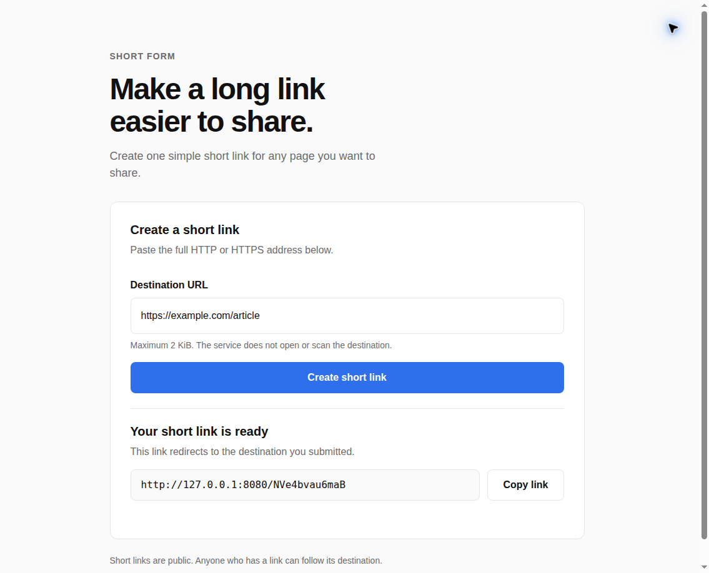

# URL Shortener

An anonymous URL shortener for local development. The Rust API validates HTTP(S) destinations, allocates stable short codes, and redirects visitors. A Vue 3 and TypeScript frontend runs in its own NGINX Deployment and reverse-proxies same-origin API and short-code requests to the internal API Service. Apache Cassandra is the authoritative mapping store when deployed. The Helm chart defines two frontend replicas, two API replicas, and a three-node Cassandra StatefulSet for the local `kind` cluster.

A complete document map is available in the [Documentation index](docs/README.md).

This project is based on ByteByteGo's [Design a URL Shortener](https://bytebytego.com/courses/system-design-interview/design-a-url-shortener) exercise.

This is a local MVP. Do not expose anonymous creation publicly: authentication, rate limiting, abuse response, production backup/recovery, and availability policy have not been designed. The local kind cluster has one Kubernetes node, so Cassandra's replicas share one failure domain.

## Contents

- [Behavior and architecture](#behavior-and-architecture)
- [Toolchain](#toolchain)
- [Automated tests](#automated-tests)
- [SonarQube](#sonarqube)
- [Local kind deployment](#local-kind-deployment)
- [Build, use, and resource prerequisites](#build-use-and-resource-prerequisites)
- [Undeploy](#undeploy)
- [Screenshots](#screenshots)
- [AI development disclaimer](#ai-development-disclaimer)

## Behavior and architecture

- Accepts HTTP(S) destinations up to 2 KiB; rejects embedded credentials and invalid input; canonicalizes before storage.
- Reuses the same Short Code for an already stored canonical destination.
- Derives a case-sensitive Base62 Short Code from SHA-256; starts at 12 characters and extends on collisions.
- Uses Cassandra lightweight `INSERT ... IF NOT EXISTS` on the Short Code partition as the cross-replica allocation authority. Redis is not needed for this invariant.
- `POST /api/v1/links` returns `201` for a new mapping or `200` for an existing mapping, with `{ "code", "short_path" }`.
- `GET /{code}` returns a cacheable `301`, `404` for an unknown code, or `503` when storage is unavailable.
- The API never fetches a submitted destination and avoids logging it.

See the [system design](docs/design/url-shortener/design.md), [feature brief](docs/design/url-shortener/brief.md), [evidence record](docs/design/url-shortener/evidence.md), [Helm deployment design](docs/design/helm-deployment/design.md), [Helm change brief](docs/design/helm-deployment/brief.md), [WebMCP feature brief](docs/design/webmcp/brief.md), [WebMCP evidence](docs/design/webmcp/evidence.md), [OpenAPI contract](docs/design/url-shortener/openapi.yaml), [API guide](url-shortener-api/README.md), and [frontend guide](url-shortener-frontend/README.md).

The frontend progressively exposes a WebMCP `create-short-link` tool in supported browsers. It reuses the same create flow as the Vue form and keeps the page state synchronized. See the [frontend WebMCP setup and security notes](url-shortener-frontend/README.md#browser-agent-support-webmcp); the feature is experimental and does not replace the regular form.

## Toolchain

The project pins Rust `1.98.1`, Node.js `24.21.0` LTS, Vue `3.5.43`, Apache Cassandra `5.0.9`, and Helm `4.3.0`. The Rust service uses the Cassandra-compatible Scylla Rust CQL driver `1.9.0`. The frontend uses unprivileged NGINX `1.30.5`. The existing kind cluster was verified at Kubernetes `v1.37.0` on 2026-09-23. Recheck official release sources before changing pins: [Rust](https://blog.rust-lang.org/releases/), [Node.js](https://nodejs.org/en/about/previous-releases), [Vue](https://github.com/vuejs/core/blob/main/CHANGELOG.md), [Apache Cassandra](https://cassandra.apache.org/_/download), [NGINX](https://nginx.org/en/download.html), [Helm](https://github.com/helm/helm/releases), and [Kubernetes](https://kubernetes.io/releases/).

## Automated tests

Requirements: Rust `1.98.1` with `rustfmt` and `clippy`, Node.js `24.21.0`, npm `11.19.0`, Docker, Helm `4.3.0`, kubectl, and kind.

```sh
# Rust unit and Cassandra-backed integration tests. The script starts and removes a temporary Cassandra 5.0.9 container.
./scripts/test-backend.sh

# Frontend checks
cd url-shortener-frontend
npm ci
npm run typecheck
npm run lint
npm run test:unit
npm run test:unit:coverage
npm run build
```

Playwright end-to-end tests target the running application. Keep a port-forward active in another terminal, install Chromium once, then run:

```sh
cd url-shortener-frontend
npm ci
npx playwright install chromium
BASE_URL=http://127.0.0.1:8080 npm run test:e2e
```

The E2E flow creates and copies a link, verifies the redirect `Location` and cache policy without following it, and checks an unknown-code `404`.

## SonarQube

The monorepo is analyzed as the SonarQube Cloud project `marcelomiyake_url-shortener`, connected to GitHub with Automatic Analysis enabled. A push to the default branch or a pull request starts analysis automatically. Verify that SonarCloud analyzed the pushed revision, then inspect its full issue list and quality gate through the Cloud project or configured MCP. No local scanner script or token is needed. Local coverage tests remain separate evidence; Automatic Analysis does not import them.

## Local kind deployment

The chart at [`deploy/helm/url-shortener`](deploy/helm/url-shortener) owns the frontend and API Deployments/Services plus Cassandra Services/StatefulSet. They remain separate pods. The browser-facing `url-shortener` ClusterIP Service selects the two frontend pods; NGINX forwards API and short-code routes to the internal `url-shortener-api` Service. Cassandra runs as a three-pod StatefulSet with one persistent volume per pod. Its keyspace uses `NetworkTopologyStrategy`, replication factor `3`, `LOCAL_QUORUM` reads/writes, and `LOCAL_SERIAL` conditional writes. No Ingress or public endpoint is created.

Cassandra-owned schema is maintained in [`database/cassandra`](database/cassandra); Cassandra deployment settings live under `cassandra:` in the Helm chart values. The API loads the schema at build time, so its Docker image must be built with the repository root as context. An unused legacy relational SQL schema was removed; it was not a Cassandra migration or data backup and contained no mapping rows to restore. Current mappings are unavailable after namespace deletion; the deploy command creates fresh Cassandra volumes and does not restore previous mappings.

**Current local state (2026-09-23):** the `url-shortener` namespace was deleted to reduce host resource use. Read-only inspection confirmed the namespace is absent and there are no PVCs or PVs in the cluster. The application is not currently deployed, and its previous mappings are unavailable from the cluster. No external backup or recovery copy has been verified. The deployment script can recreate the application with fresh Cassandra volumes; recover old mappings only from a separately verified source or backup.

```sh
# Build images, verify the existing kind target, load them into kind, and install/upgrade the Helm release.
./scripts/deploy-kind.sh

# Keep running while using the frontend or running browser tests.
kubectl --context kind-kind --namespace url-shortener \
  port-forward service/url-shortener 8080:8080
```

The deploy script requires Helm `4.3.0` and refuses to proceed unless the active context is `kind-kind`, the existing `kind` cluster and `standard` StorageClass are available, and cluster information is readable. It does not create, switch, upgrade, or delete a cluster. Helm retains Cassandra PVCs when the StatefulSet/release is removed, but deleting the namespace deletes the PVC claims. Keep any needed backup outside the namespace. Verify two ready frontend pods, two ready API pods, three ready Cassandra pods, and three bound Cassandra volumes before using the service. The one-node local kind topology is suitable for scale-out behavior tests but does not provide node-level Cassandra high availability.

## Build, use, and resource prerequisites

- **Build and deploy:** Rust `1.98.1`, Node.js `24.21.0`/npm `11.19.0`, Docker, Helm `4.3.0`, kubectl, and the existing `kind-kind` cluster with the `standard` StorageClass.
- **Use:** a browser, a healthy local Kind release, and a loopback port-forward to the frontend. Submitted destinations must be synthetic or otherwise approved for local testing.

## Undeploy

Stop the port-forward with Ctrl-C and uninstall the chart without deleting the namespace:

```sh
helm --kube-context kind-kind uninstall url-shortener --namespace url-shortener
```

The chart retains Cassandra PVCs when its StatefulSet is removed. Deleting the namespace deletes those claims and the locally stored mappings. CPU, memory, and ephemeral-storage requests and limits are in [Kubernetes resource budgets](docs/kubernetes-resources.md).

## Screenshots




## AI development disclaimer

> **AI development disclaimer:** This project was built entirely with GPT-6 Luna at Max effort as a proof of concept exploring how low-cost AI plans can be useful when paired with disciplined harness and loop engineering. This is project-owner attribution; repository contents do not independently verify runtime model metadata. Review AI-generated design and code before relying on them.
