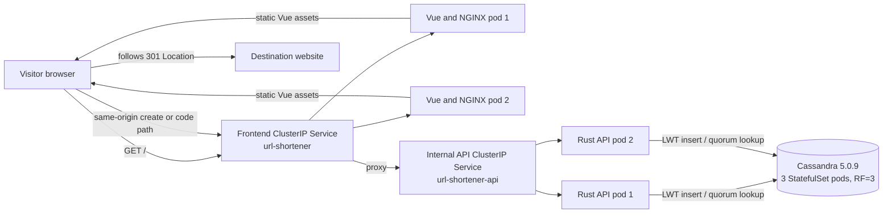
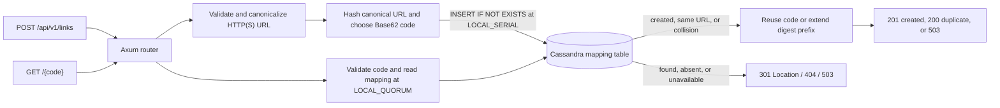
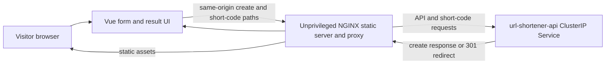
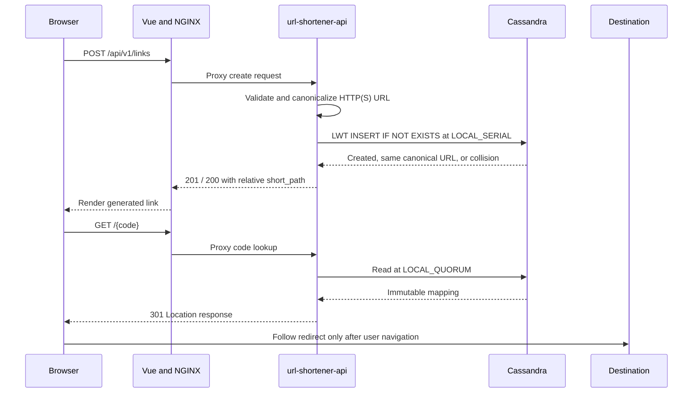

# URL Shortener MVP — System Design

Deployment packaging and Cassandra file ownership are described in the [Helm deployment design](../helm-deployment/design.md) and [implementation evidence](../helm-deployment/evidence.md).

> Project documentation index: [Documentation index](../../README.md)

> Project decision records: [ADR index](../../adr/README.md).

> Database tables, columns, and ownership: [Database model](../../database-model.md).

**Status:** User-approved local-MVP design. The implementation is local-development-only and is not approved for public launch or production operations.
**Owner:** project owner, with engineering review.
**Requirements:** [brief.md](brief.md). **HTTP contract:** [openapi.yaml](openapi.yaml). **Observed implementation and verification:** [evidence.md](evidence.md).


## Contents

- [Abstract](#abstract)
- [Goals and non-goals](#goals-and-non-goals)
- [Background and problem statement](#background-and-problem-statement)
- [1. Domain and invariants](#1-domain-and-invariants)
- [2. Architecture](#2-architecture)
  - [Service-level architecture](#service-level-architecture)
- [3. API contract](#3-api-contract)
- [Consistency, idempotency, and replay](#consistency-idempotency-and-replay)
- [Security and privacy considerations](#security-and-privacy-considerations)
- [4. Destination URL policy](#4-destination-url-policy)
- [5. Cassandra data model and code allocation](#5-cassandra-data-model-and-code-allocation)
- [6. Data state and retired artifacts](#6-data-state-and-retired-artifacts)
- [7. Kubernetes and local `kind`](#7-kubernetes-and-local-kind)
- [Operational readiness](#operational-readiness)
- [8. Automated verification](#8-automated-verification)
- [9. Open decisions before public use](#9-open-decisions-before-public-use)
- [Decision and next steps](#decision-and-next-steps)
- [References and traceability](#references-and-traceability)

## Abstract

The service creates immutable short links for validated HTTP(S) destinations, resolves codes through Cassandra, and returns redirects without fetching the destination itself. A Vue/NGINX frontend proxies to a stateless Rust API; Cassandra conditional writes coordinate code allocation across replicas.

## Goals and non-goals

- **Goals:** deterministic short codes; durable mappings; safe validation; cross-replica collision handling; observable local Kind deployment.
- **Non-goals:** public unauthenticated launch, destination fetching, custom aliases, edit/delete/expiry, production HA, and an unmeasured capacity claim.

## Background and problem statement

The MVP explores URL-shortening requirements while keeping local operation bounded. A local one-node Kind cluster demonstrates multi-pod coordination but does not provide independent failure domains or public-service controls.

## 1. Domain and invariants

The **Short Link** bounded context owns create and resolve behavior. The Rust API enforces its rules; Cassandra is authoritative for immutable mappings. The Vue frontend is a same-origin consumer and does not own code allocation or persistence.

Ubiquitous language:

- **Destination URL:** the visitor-supplied HTTP(S) address.
- **Canonical Destination URL:** `url::Url` serialization after parser normalization.
- **Short Code:** case-sensitive Base62 token derived from the canonical URL's SHA-256 digest.
- **Short Link:** immutable mapping from one Short Code to one Canonical Destination URL.

Invariants:

1. At most one Short Link exists for a Canonical Destination URL.
2. A Short Code identifies at most one mapping.
3. A create response is returned only after its mapping is committed.
4. A known Short Code resolves to the exact Canonical Destination URL persisted for it.
5. Neither shortening nor redirect handling fetches the Destination URL; logs omit it.
6. Short Codes are public addresses, not credentials or authorization secrets.

## 2. Architecture



The frontend and API are separate build artifacts and Kubernetes Deployments, each with two replicas. The frontend Service is the port-forward target and NGINX proxies `/api/*` and Short Code paths to the API ClusterIP Service. Cassandra is an independent StatefulSet with one PVC per pod. The local `kind` cluster has one Kubernetes node, so the Cassandra processes and volumes do not span failure domains; replica count here demonstrates partitioning and multi-replica coordination, not node-level availability.

OpenDesign's Neutral Modern design handoff is in [`../../../url-shortener-frontend/DESIGN.md`](../../../url-shortener-frontend/DESIGN.md). OpenDesign is design-time tooling and is not part of either runtime image.

### Architecture practice fit

DDD and a small Clean Architecture boundary fit the Short Link domain: URL policy and deterministic code allocation are business rules, [`domain.rs`](../../../url-shortener-api/src/short_link/domain.rs) models them, [`service.rs`](../../../url-shortener-api/src/short_link/service.rs) coordinates use cases, and [`cassandra_repository.rs`](../../../url-shortener-api/src/infrastructure/cassandra_repository.rs) owns persistence. Keep Axum and Cassandra behind those existing boundaries; additional interfaces for each type would not improve the two current operations. Creation and resolution have different read/write paths, but they share one immutable mapping and uniqueness rule, so a second CQRS model or asynchronous projection would add consistency work without a current requirement. YAGNI, KISS, and DRY favor keeping the direct Cassandra lookup/LWT allocation path and one authoritative contract.

### Service-level architecture

#### `url-shortener-api`



#### `url-shortener-frontend`



## 3. API contract

The canonical contract is [openapi.yaml](openapi.yaml).

- `POST /api/v1/links` accepts `destination_url`. A new Short Link returns `201`; a canonical duplicate returns `200`. Both include `code` and relative `short_path` (`/{code}`), independent of the incoming `Host` header.
- Malformed JSON returns `400`; destination policy failures return `422`; storage/code allocation failures return `503`.
- `GET /{code}` returns `301 Moved Permanently` with `Location` for a known code, `404` for malformed or unknown codes, and `503` when Cassandra cannot serve the lookup.
- Known-code redirects use `Cache-Control: public, max-age=3600`. Mappings are immutable and no revocation flow exists, so this duration needs review before broader exposure.
- `/health/live` checks the process. `/health/ready` runs a Cassandra partition read at `LOCAL_QUORUM` so it checks whether storage quorum can serve the API.

The frontend derives its displayed absolute Short Link from the current origin and the validated relative `short_path`. It treats returned values as text, not active markup.


### Contract ownership and consumers

| Interface | Owner | Producer | Known consumers by repository/component | Authority |
| --- | --- | --- | --- | --- |
| Short Link REST and redirect API | `url-shortener` / `url-shortener-api` | `url-shortener-api` | Same repository: `url-shortener-frontend`; other-repository consumers: unknown | [OpenAPI](openapi.yaml) and API implementation |
| Cassandra Short Link mapping schema | `url-shortener` / `database/cassandra` owns schema; API owns applying it | `url-shortener-api` writes mappings | Same repository: `url-shortener-api`; frontend does not access Cassandra; other-repository consumers: unknown | [CQL schema](../../../database/cassandra/schema/short_links_by_code.cql) |
| Frontend same-origin proxy paths | `url-shortener` / `url-shortener-frontend` | Browser via frontend/NGINX | Same repository: `url-shortener-api`; other-repository consumers: unknown | [NGINX configuration](../../../url-shortener-frontend/nginx.conf) |

See the [contract catalog](../../contracts/README.md) for compatibility and WebMCP consumer details.


### Request lifecycle



The server does not fetch the submitted destination.

## Consistency, idempotency, and replay

| Scenario | Behavior |
| --- | --- |
| Same canonical URL submitted again | Deterministic candidate returns the existing mapping with `200`. |
| Two API replicas race for a code | Cassandra LWT serializes the conditional write; a conflicting digest prefix extends to the next character. |
| Cassandra is unavailable or quorum is lost | Readiness fails and create/resolve return `503`; no mapping is acknowledged without commit. |
| Repeated code lookup | The same immutable mapping resolves; the API never modifies a mapping during redirect. |

The create operation is idempotent by canonical destination. It does not promise exactly-once client requests and has no mapping deletion or replay job.

## Security and privacy considerations

The backend rejects credentials and malformed or non-HTTP(S) URLs. It never performs DNS resolution or fetches submitted destinations, which removes server-side request forgery through create or redirect handling. The local deployment has no user authentication, rate limiting, abuse response, or public exposure approval. Traces omit submitted URLs; synthetic or approved local test input only.

## 4. Destination URL policy

The backend is the policy authority. It rejects empty, malformed, control-character-containing, non-HTTP(S), credential-bearing, leading/trailing-whitespace, or over-2-KiB input. The size limit applies before parsing and after canonical serialization. The Rust `url` parser normalizes host casing, default ports, and path segments. The backend performs no DNS lookup or outbound request. Tracing fields never include the submitted or stored URL.

The Vue form may provide convenience validation, but it does not replace backend validation. Destinations and API messages are rendered as text.

## 5. Cassandra data model and code allocation

The table in `database/cassandra/schema/short_links_by_code.cql` is query-oriented:

```sql
CREATE TABLE url_shortener.short_links_by_code (
    code text PRIMARY KEY,
    canonical_url text,
    created_at timestamp
);
```

There is one row per Short Code, and `code` is the partition key. Resolution is a direct partition lookup. The service does not need a second query-by-URL index: the same canonical string always produces the same SHA-256 digest and initial candidate code. This makes create/deduplicate a single allocation path; it also means canonical-URL equality is not an independently queryable Cassandra access pattern.

The API encodes the 256-bit digest as a zero-padded 43-character Base62 string and initially tries its first 12 characters. It inserts with `IF NOT EXISTS` using a lightweight transaction. If the candidate already holds the same canonical URL, the request reuses the code. If another canonical URL owns it, the API extends the prefix one character and tries again. If a digest-prefix collision occurs on multiple API replicas, Cassandra serializes the conditional write for that partition; one mapping wins and the others read it or extend to the next candidate. The maximum code is the complete 43-character digest. Exhaustion returns `503`; it never overwrites a row.

This design deliberately avoids Redis. A process-local lock would not coordinate API pods; Cassandra's conditional write is the authority colocated with the mapping. Automated integration tests connect through two separate Cassandra sessions and issue concurrent requests through separate API routers. Deployment checks exercise requests through the multi-replica API Service.

Keyspace replication uses `NetworkTopologyStrategy` for local datacenter `datacenter1`, replication factor `3`. Regular lookups and writes use `LOCAL_QUORUM`; LWT serial consistency is `LOCAL_SERIAL`. This keeps each link's full row in one partition and lets API replicas coordinate through Cassandra. LWT/Paxos costs more latency and coordination than ordinary writes, so measure before setting production throughput targets. The project has no measured public traffic or latency target.

Cassandra schema setup is performed by the API at startup using `CREATE ... IF NOT EXISTS`; the current local Cassandra cluster has authentication disabled. Production deployment requires an owned schema migration/permission process, TLS, authentication, multi-rack placement, backups, restore tests, and explicit RPO/RTO before public use.

### Alternatives considered

- **Relational storage:** it provides straightforward relational queries and transaction semantics. Cassandra was selected for the requested partitioned data and multi-node write path. Revisit the choice if query patterns, consistency needs, or operational constraints change.
- **Cassandra plus Redis ID allocation:** rejected because deterministic candidate codes plus per-partition LWT already provide cross-replica uniqueness. Redis would add another availability and consistency dependency without protecting a missing invariant.
- **Random code plus lookup/index:** not selected because it would require a second canonical-URL index or extra allocation round trips and conflict handling; keep the current hash-derived behavior unless a product requirement justifies that complexity.

## 6. Data state and retired artifacts

The previous local cutover copied and verified five mappings before directing the API to Cassandra. The owner later deleted the `url-shortener` namespace. The current kind cluster has no project namespace, PVCs, or PVs (see the [evidence record](evidence.md)); the application is not deployed, and the prior mappings are unavailable from the cluster. No external backup has been verified.

The active application is Cassandra-only. The old relational schema file was not referenced by the API, build, tests, or deployment and has been removed. The old database manifest and JSON import command have also been retired; they cannot recover mappings without an actual source/backup. A fresh Helm install creates empty Cassandra volumes. If a backup is later found, define a separate import job against its actual format rather than treating an old schema file as recoverable data.

## 7. Kubernetes and local `kind`

The deployment targets only the existing `kind-kind` context and `kind` cluster. `scripts/deploy-kind.sh` inspects context, cluster, server/node version, and the `standard` StorageClass before Kubernetes changes. It does not create, switch, upgrade, or delete clusters.

The single Helm release at `deploy/helm/url-shortener` creates the `url-shortener` namespace on first install, frontend Service/Deployment (2), internal API Service/Deployment (2), and Cassandra headless/ClusterIP Services plus a 3-pod StatefulSet with three `standard` PVCs. Application images use explicit tags and are loaded locally into kind. All Services are ClusterIP; there is no Ingress. Port-forward `service/url-shortener` to test the browser-facing endpoint. The chart uses Helm `v2` chart API and is validated with Helm `4.3.0`.

Cassandra resource requests/limits and heap are sized for a local developer cluster, not production. The local cluster currently has one Kubernetes node, so a node failure stops the application and all Cassandra replicas together. Cassandra readiness checks local CQL availability; API readiness checks quorum access to its table. Storage failure makes API readiness fail and create/redirect return `503`. The chart retains claims when the StatefulSet is deleted, but deleting the namespace deletes its namespaced PVC claims; Helm is not a backup system.


### Resource budgets and Kubernetes practice

Every pod template has CPU, memory, and ephemeral-storage requests and limits for each workload container. The concrete local values are maintained in [Kubernetes resource budgets](../../kubernetes-resources.md); they are local defaults, not measured consumption or production sizing. Measure representative workloads in the target environment, set requests for observed baseline needs and limits for acceptable bursts, then monitor CPU throttling, memory pressure, ephemeral-storage use, and OOM events and adjust deliberately.

## Operational readiness

Build and install through `./scripts/deploy-kind.sh` only after confirming the existing `kind-kind` context and `standard` StorageClass. Verify two frontend replicas, two API replicas, three Cassandra pods, and all three bound PVCs before use. Stop the port-forward and run `helm --kube-context kind-kind uninstall url-shortener --namespace url-shortener` to remove the application while retaining claims; namespace deletion removes the PVCs and local mappings. Per-container CPU, memory, and ephemeral-storage requests and limits are in [Kubernetes resource budgets](../../kubernetes-resources.md). Monitor Cassandra readiness, disk capacity, and resource throttling; local replica count is not HA.

## 8. Automated verification

- **Unit tests:** URL parsing/canonicalization, size/scheme/credential rules, deterministic Base62 encoding, prefix extension, settings validation, service duplicate/collision behavior, and safe storage failure.
- **Integration tests:** temporary Cassandra 5.0.9, real CQL LWT operations, canonical duplicate behavior, forced collision, same-URL concurrency through independent sessions, `201`/`200`/`301`/`404`/`503` semantics, validation failures, and persistence across a real API process restart.
- **Frontend unit/component tests:** request contract, user-visible success/error states, and copy feedback.
- **Browser E2E:** Playwright against the deployed kind app verifies keyboard-operable creation and copy, `Location` and cache headers without following off-site, and unknown-code `404`.
- **Helm checks:** `helm lint` and `helm template` verify generated Services/Deployments/StatefulSet, replica counts, in-namespace Cassandra contact points, probes, image tags, and PVC settings.
- **Deployment checks:** two ready frontend pods, two ready API pods, three ready Cassandra pods and PVCs, concurrent create requests through the API Service, and create-and-redirect through NGINX.

These checks demonstrate local behavior. They do not demonstrate production-scale throughput, public abuse handling, independent-failure-domain availability, disaster recovery, or operational readiness.

## 9. Open decisions before public use

1. What authentication, rate limits, abuse reporting/takedown, and domain policy are required before public exposure?
2. What production Cassandra datacenter/rack topology, replication factor, consistency levels, TLS/authentication, backup/restore process, and recovery targets replace the local kind setup?
3. Is a one-hour cache for immutable redirects acceptable, including its effect on revocation?
4. Should a later requirement support edit/delete/expiration or analytics? Such operations would change the immutability and caching model.

## Decision and next steps

The selected local design is a stateless two-replica Rust API, a two-replica Vue/NGINX frontend, and a three-pod Cassandra StatefulSet using a deterministic code candidate plus per-partition LWT for uniqueness. Keep the deployment loopback-only and the mapping store immutable. Public launch remains out of scope until authentication, abuse controls, restore-tested backups, multi-failure-domain placement, and production resource sizing have named owners and verified evidence.

## References and traceability

- [Project README](../../../README.md) — supported build/deploy/use lifecycle.
- [Contract catalog](../../contracts/README.md) — owners, producers, consumers, and compatibility.
- [OpenAPI contract](openapi.yaml) — authoritative HTTP schema.
- [Helm chart guide](../../../deploy/helm/url-shortener/README.md) and [Helm deployment design](../helm-deployment/design.md).
- [Kubernetes resource budgets](../../kubernetes-resources.md) — configured CPU, memory, and ephemeral-storage requests and limits.
